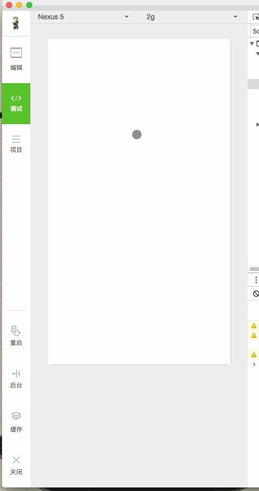

# XiaoxiazhihuWx

---

参考知乎日报，使用网络上的[Api](https://github.com/izzyleung/ZhihuDailyPurify/wiki/%E7%9F%A5%E4%B9%8E%E6%97%A5%E6%8A%A5-API-%E5%88%86%E6%9E%90)，仿写了一个知乎日报客户端。

由于使用非正常手段获取Api，若被告知需停止共享与使用，本人会及时删除此页面与整个项目。

客户端使用微信小程序进行开发，使用方式见后面。

## 其他客户端

[XiaoxiaZhihu iOS客户端](https://github.com/LiushuiXiaoxia/XiaoxiaZhihu_iOS)

[XiaoxiaZhihu Android客户端Java版本](https://github.com/LiushuiXiaoxia/XiaoxiaZhihu)

[XiaoxiaZhihu Android客户端Kotlin版本](https://github.com/LiushuiXiaoxia/XiaoxiaZhihu_Kotlin)

[XiaoxiaZhihu客户端ReactNative版本](https://github.com/LiushuiXiaoxia/XiaoxiaZhihuRN)

[XiaoxiaZhihu客户端Weex版本](https://github.com/LiushuiXiaoxia/XiaoxiaZhihuWeex)

[XiaoxiaZhihu客户端微信小程序](https://github.com/LiushuiXiaoxia/XiaoxiazhihuWx)

## 效果图

不知道是不是开发姿势问题，一些图片不能加载出来。

## 使用

按照[官方文档](https://mp.weixin.qq.com/debug/wxadoc/dev/?t=1474644083132)的介绍方式下载ide，然后导入源码，最后按照上图方式，点击重启左边的按钮，即可预览效果。

## 总结

微信的这个小程序还是蛮简单的，由于没有提供weburl的跳转，以及html直接渲染，导致最后详情页面不能进行预览，只是简单的显示了html文本。

如果原先研究过React Native和Weex，基本上很容易上手的，和前面两者开发很相似。

## 后续

* 等待微信全部开放出来以后，再进行优化吧。